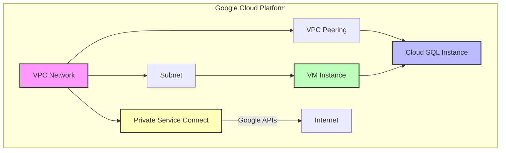

# Terraform GCP Infrastructure

This repository contains Terraform configurations for deploying infrastructure on Google Cloud Platform (GCP).

## Project Structure

```
.
├── environments/
│   └── np/
│       ├── backend.tf
│       ├── main.tf
│       ├── providers.tf
│       ├── terraform.tfvars
│       └── variables.tf
├── modules/
│   ├── vm/
│   │   ├── main.tf
│   │   ├── outputs.tf
│   │   └── variables.tf
│   ├── vpc/
│   │   ├── main.tf
│   │   ├── outputs.tf
│   │   └── variables.tf
│   ├── psc/
│   │   ├── main.tf
│   │   ├── outputs.tf
│   │   └── variables.tf
│   └── cloudsql/
│       ├── main.tf
│       ├── outputs.tf
│       └── variables.tf
├── .gitignore
├── README.md
└── cloudbuild.yaml

```

- `environments/`: Contains environment-specific configurations
  - `np/`: Non-production environment
- `modules/`: Reusable Terraform modules
  - `vm/`: Virtual Machine module
  - `vpc/`: VPC network module
- `cloudbuild.yaml`: Cloud Build configuration for CI/CD

## Architecture



The diagram illustrates the key components of our infrastructure:
- A VPC network with a subnet hosting the VM instance
- A Cloud SQL instance connected via VPC peering for private access
- Private Service Connect (PSC) endpoint for secure access to Google APIs
- All components are connected through private networking for enhanced security

## Usage

1. Navigate to the desired environment directory (e.g., `cd environments/np`)
2. Initialize Terraform: `terraform init`
3. Plan the changes: `terraform plan`
4. Apply the changes: `terraform apply`

## Modules

### VM Module

Creates a Google Compute Engine instance with internal network access only.

### VPC Module

Creates a VPC network with a subnet and firewall rules.

### PSC Module

Creates a Private Service Connect endpoint with the following features:
- Global internal address for PSC endpoint
- Global forwarding rule for routing traffic to Google APIs
- Secure access to Google services through private network

### Cloud SQL Module

Creates a PostgreSQL Cloud SQL instance with the following features:
- Regional availability for high availability
- Private Service Connect (PSC) for secure access
- Automated backups
- Query insights enabled
- Custom maintenance windows
- Database flags configuration

The Cloud SQL module is located in `modules/cloudsql/` and includes:
- `main.tf`: Defines the Cloud SQL instance and database resources
- `variables.tf`: Declares all input variables for the module
- `outputs.tf`: Specifies the outputs provided by the module

To use the Cloud SQL module, refer to the example in `environments/np/main.tf`.

## CI/CD

This project uses Google Cloud Build for continuous integration and deployment. The `cloudbuild.yaml` file defines the build steps.

## Contributing

1. Create a new branch for your changes
2. Make your changes and commit them
3. Push your branch and create a pull request
4. After review and approval, merge your changes into the main branch

## License

[Add your license information here]
